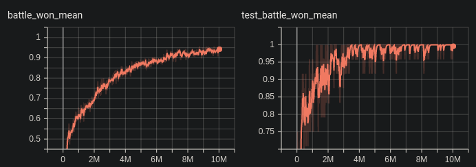

# SC2ENV Multi-agent RL

## How to run
* Prerequisite - SC2ENV
```buildoutcfg
$ virtualenv .env -ppython3
$ source .env/bin/activate
(.env) $ pip3 install -r requirements.txt
(.env) $ export SC2PATH=/your/SC2PATH
(.env) $ python3 run_model.py --path=/your/model/path
```

For the path, you may use
`--path="smix/results/models/smix__2019-12-25_04-46-04/10000741"`.

### Tested environment
Ubuntu 18.04.3 LTS 64bit  
Intel® Core™ i5-7600 CPU @ 3.50GHz × 4  
DDR4 2133 MHz 16GB × 2  
GeForce GTX 1060 6GB/PCIe/SSE2  
Python 3.6.9   
SC2 4.6  

## Performance
With `num_runs=1000`, (winning rate)=99.8%.

## Learning Curve 
  
  
x_axis=(# of iter)

## Contributors
Jaeseok Huh | jshuh@kaist.ac.kr | KAIST School of Computing  
Sungyon Jang | tjddus8174@kaist.ac.kr | KAIST Department of Mathematical Sciences  
Minjae Lee | mjbooo@kaist.ac.kr | KAIST Department of Industrial Engineering  


## License
Apache 2 License is applied: all the code under the directory `smix` and `util` is heavily borrowed from [pymarl](https://github.com/oxwhirl/pymarl) and [SMIX](https://github.com/chaovven/SMIX); Please see each repository for detailed terms.
 
 

